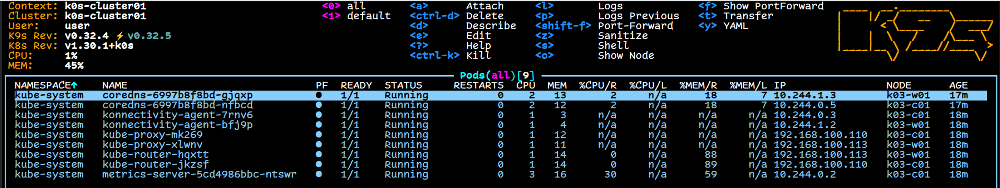
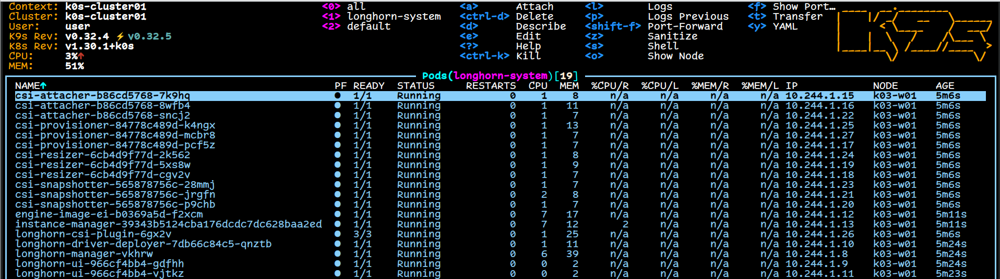
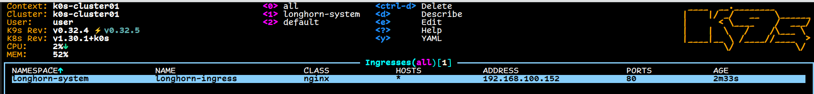

`qm clone 9000 200 --name k03c01 --full`

`qm clone 9000 201 --name k03w01 --full`

`qm set 200 --ipconfig0 ip=192.168.100.110/24,gw=192.168.100.1 --nameserver 192.168.100.1 --searchdomain home.d4n3sh.com`

`qm set 201 --ipconfig0 ip=192.168.100.113/24,gw=192.168.100.1 --nameserver 192.168.100.1 --searchdomain home.d4n3sh.com`

`qm disk resize 200 scsi0 20G`

`qm disk resize 201 scsi0 100G`

`qm set 200 --cores 2 --memory 2048 --sockets 1`

`qm set 201 --cores 2 --memory 2048 --sockets 1`

`qm destroy 200`

`qm destroy 201`

`qm start 200`

`qm start 201`

`ansible-playbook -i ansible/inventory ansible/playbook.yaml`

Install the k0sctl cli tool on macOS  
`brew install k0sproject/tap/k0sctl`

`k0sctl init --k0s --cluster-name k0s-cluster01 --controller-count 1 --user danesh k0sc01 k0sw01  > k0sctl.yaml`

`k0sctl apply --config k0s/k0sctl.yaml --dry-run`

`k0sctl apply --config k0s/k0sctl.yaml`

`k0sctl kubeconfig --config k0s/k0sctl.yaml > k0s-cluster01.kubeconfig`

`kubectl --kubeconfig k0s-cluster01.kubeconfig get nodes --show-labels`

```bash
❯ kubectl --kubeconfig k0s-cluster01.kubeconfig get nodes --show-labels
NAME      STATUS   ROLES           AGE     VERSION       LABELS
k03-c01   Ready    control-plane   3m42s   v1.30.1+k0s   beta.kubernetes.io/arch=amd64,beta.kubernetes.io/os=linux,kubernetes.io/arch=amd64,kubernetes.io/hostname=k03-c01,kubernetes.io/os=linux,node-role.kubernetes.io/control-plane=true,node.k0sproject.io/role=control-plane
k03-w01   Ready    <none>          3m36s   v1.30.1+k0s   beta.kubernetes.io/arch=amd64,beta.kubernetes.io/os=linux,kubernetes.io/arch=amd64,kubernetes.io/hostname=k03-w01,kubernetes.io/os=linux
```
`k9s --kubeconfig k0s-cluster01.kubeconfig`



## MetalLB
`helm --kubeconfig ~/.secrets/k0s-cluster01.kubeconfig install metallb metallb/metallb --namespace metallb-system --create-namespace`

`kubectl --kubeconfig ~/.secrets/k0s-cluster01.kubeconfig -n metallb-system apply -f metallb/ipAddressPools.ym`

## Longhorn CSI
`helm repo add longhorn https://charts.longhorn.io`

`helm repo update`

`helm install longhorn longhorn/longhorn --kubeconfig k0s-cluster01.kubeconfig --namespace longhorn-system --create-namespace --version 1.6.2`



## Nginx Ingress Controller
`helm repo add ingress-nginx https://kubernetes.github.io/ingress-nginx`

`helm repo update`

`helm install ingress-nginx ingress-nginx/ingress-nginx --kubeconfig k0s-cluster01.kubeconfig --namespace ingress-nginx-system --create-namespace`

`kubectl --kubeconfig k0s-cluster01.kubeconfig apply -f longhorn/longhornIngress.yaml`


